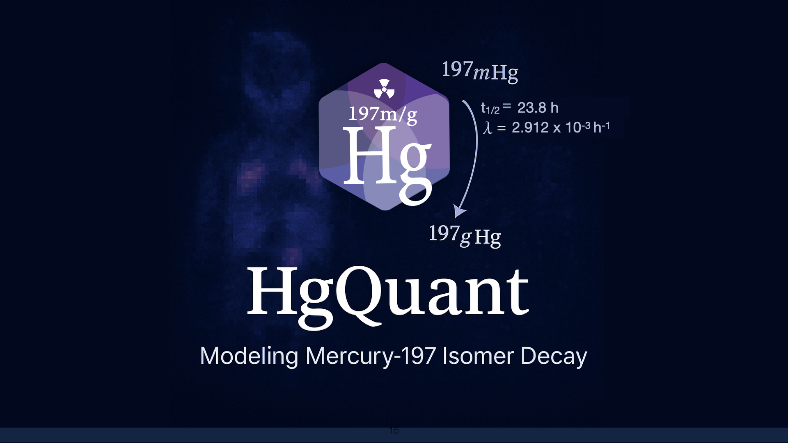
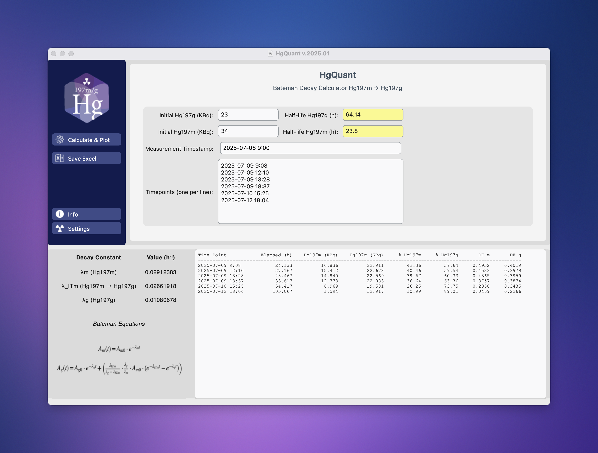
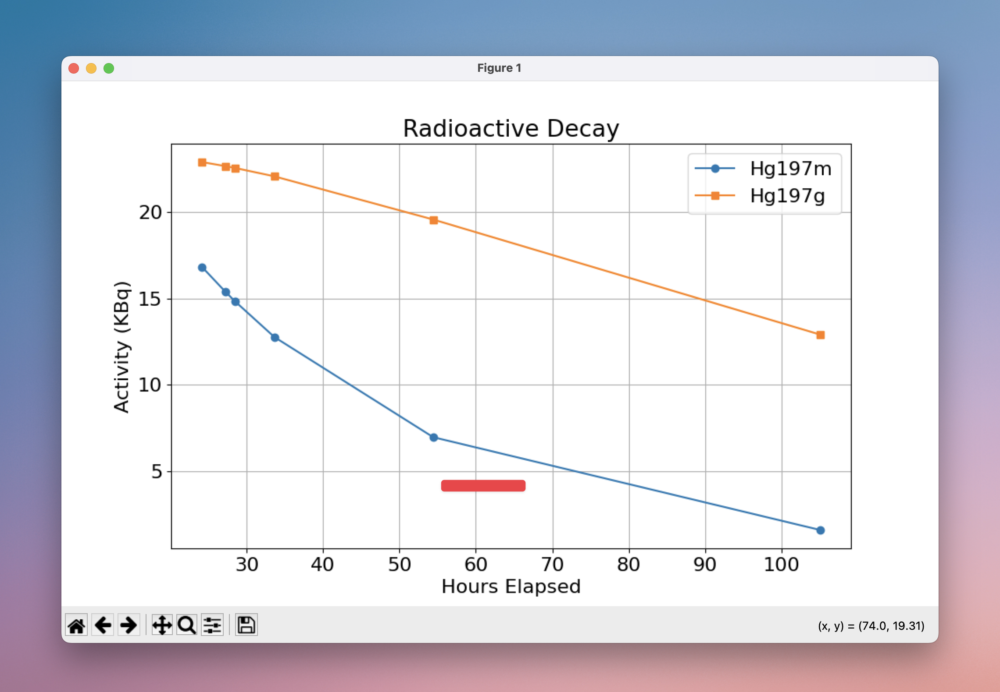
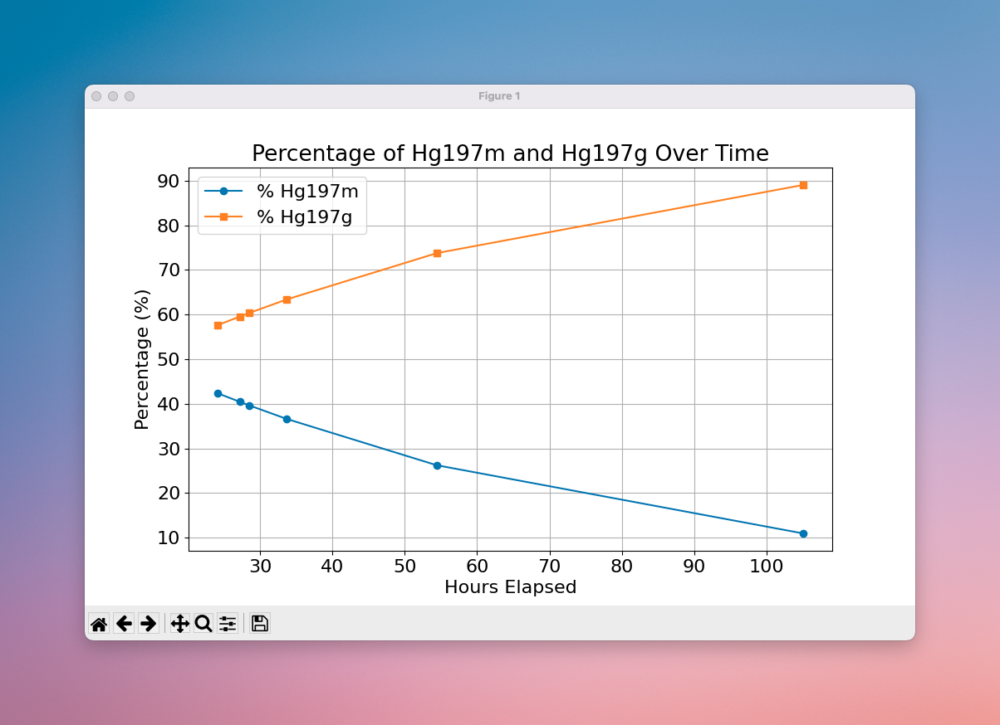

  

# HgQuant

HgQuant is a Python-based application for modelling the radioactive decay of Mercury-197 isomers — specifically the transition from ¹⁹⁷mHg to ¹⁹⁷gHg — using Bateman equations.

Designed for researchers working with ¹⁹⁷m/gHg SPECT imaging or ex vivo biodistribution data, HgQuant allows accurate estimation of time-resolved activity distributions based on customizable parameters, including:

Initial activity of ¹⁹⁷mHg and ¹⁹⁷gHg

Half-lives and decay constants

Activity or activity concentration units

Imaging or measurement time points

### Key features include:

Interactive GUI (built with CustomTkinter)

Timepoint-based decay correction for both phantoms and in vivo experiments

Automatic decay factor calculation

Output in absolute activity or percentage

Tabular outputs, exportable plots, and Excel reports

HgQuant helps streamline data correction and quantification in hybrid ¹⁹⁷Hg in vivo/ex vivo workflows, ensuring reproducibility and facilitating image interpretation.

